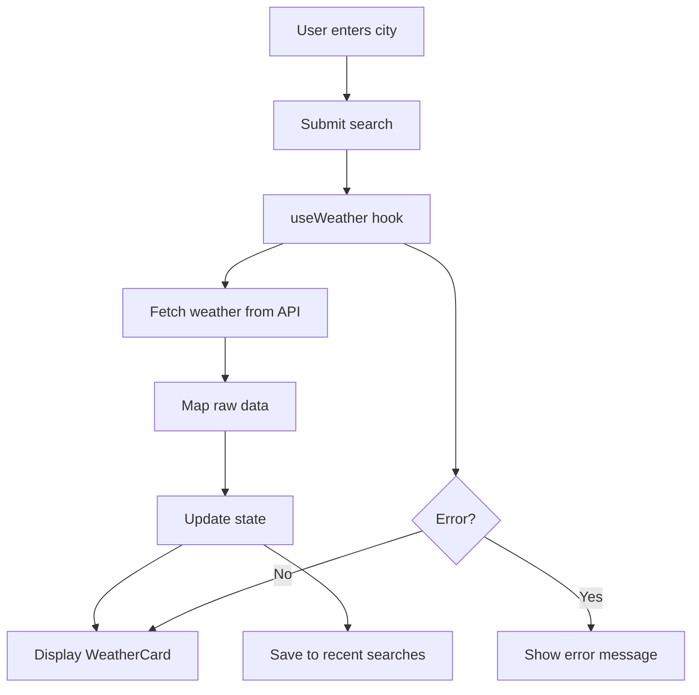

# 🌤️ Weather Mini Tool

A simple weather web app built with **Create React App (vanilla JavaScript)** that fetches real-time weather data by city name using the OpenWeatherMap API.

---

## 🚀 Features

- 🔎 Search weather by city
- 🌡️ Temperature in °C or °F
- 💧 Humidity, wind speed, pressure, visibility
- 🕘 Recent searches (saved in browser)
- ❗ Error handling (invalid city, missing API key)
- 🧠 Clean architecture (config, services, hooks, components)

---

## 🖥️ Tech Stack

- React (Create React App)
- Vanilla JavaScript
- OpenWeatherMap API
- CSS (plain)

---

## 📂 Project Structure

```
src/
  components/      UI components
  hooks/           Custom React hooks
  services/        API calls + data mapping
  config/          Environment + constants
  utils/           Formatting helpers
  App.jsx          Main app component
```

---

## 🔐 Setup Instructions

### 1️⃣ Clone the repository

```bash
git clone https://github.com/MahmoudNoureddine/mini-tool.git
cd mini-tool
```

---

### 2️⃣ Install dependencies

```bash
npm install
```

---

### 3️⃣ Add your API key

Create a `.env` file in the project root:

```
REACT_APP_OWM_API_KEY=YOUR_API_KEY_HERE
```

Get a free API key from:

https://openweathermap.org/api

---

### 4️⃣ Run the app

```bash
npm start
```

Open:

```
http://localhost:3000
```

---

## 🧠 Application Logic

### User Flow

1. User types a city name
2. App calls OpenWeatherMap API
3. Data is mapped to a simplified model
4. UI displays weather information
5. City is saved in recent searches

---

## 🔄 Logic Flow Diagram

GitHub supports Mermaid diagrams:



---

## 🧩 Component Responsibilities

### App.jsx
- Holds main state
- Connects components
- Handles submit logic

### SearchBar
- User input
- Submit button

### UnitToggle
- Switch °C / °F

### WeatherCard
- Displays weather data

### RecentChips
- Shows recent cities

### ErrorBanner
- Displays errors

---

## 🌐 API Endpoint Used

```
https://api.openweathermap.org/data/2.5/weather
```

Query parameters:

- `q` → city name  
- `appid` → API key  
- `units` → metric or imperial  

---

## ⚠️ Notes

- API key activation may take a few minutes
- `.env` file must not be pushed to GitHub

---

