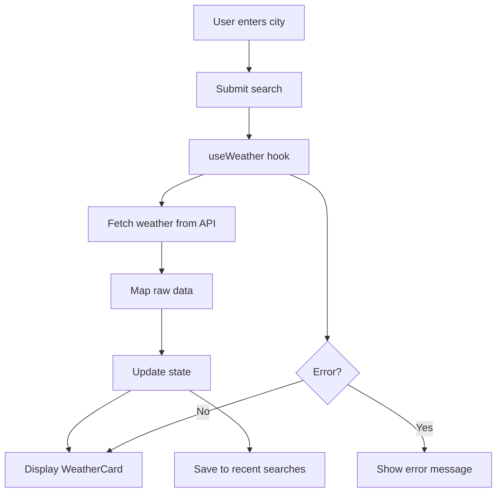

# 🌤️ Weather Mini Tool

> ⚠️ **Documentation Note**  
> This documentation was **designed and written collaboratively by Mahmoud Noureddine and [Second Student Name]** as part of the project submission.

---

## 🚀 Features

- 🔎 Search weather by city
- 🌡️ Temperature in °C or °F
- 💧 Humidity, wind speed, pressure, visibility
- 🕘 Recent searches (saved in browser)
- ❗ Error handling (invalid city, missing API key)
- 🧠 Clean architecture (config, services, hooks, components)

---

## 🖥️ Tech Stack

- React (Create React App)
- Vanilla JavaScript
- OpenWeatherMap API
- CSS (plain)

---

## 📂 Project Structure

```
src/
  components/      UI components
  hooks/           Custom React hooks
  services/        API calls + data mapping
  config/          Environment + constants
  utils/           Formatting helpers
  App.jsx          Main app component
```

---

## 🔐 Setup Instructions

### 1️⃣ Clone the repository

```bash
git clone https://github.com/MahmoudNoureddine/mini-tool.git
cd mini-tool
```

---

### 2️⃣ Install dependencies

```bash
npm install
```

---

### 3️⃣ Add your API key

Create a `.env` file in the project root:

```
REACT_APP_OWM_API_KEY=YOUR_API_KEY_HERE
```

Get a free API key from:

https://openweathermap.org/api

---

### 4️⃣ Run the app

```bash
npm start
```

Open:

```
http://localhost:3000
```

---

# 🧠 Application Logic

### User Flow

1. User types a city name
2. App calls OpenWeatherMap API
3. Data is mapped to a simplified model
4. UI displays weather information
5. City is saved in recent searches

---

# 🔄 Logic Flow Diagram

> Logic flow diagram prepared by **[Second Student Name]**

GitHub supports Mermaid diagrams:


```mermaid
flowchart TD

A[User enters city] --> B[Submit search]
B --> C[useWeather hook]
C --> D[Fetch weather from API]
D --> E[Map raw data]
E --> F[Update state]

F --> G[Display WeatherCard]
F --> H[Save to recent searches]

C --> I{Error?}
I -- Yes --> J[Show error message]
I -- No --> G
```

---

# 🧑‍💻 Code Development

> **Developed and implemented by Mahmoud Noureddine**

The weather application was developed using **React with vanilla JavaScript** following a modular architecture to ensure maintainability and scalability.

The development process focused on separating responsibilities into different layers:

### 1️⃣ Component Layer

The UI is composed of reusable React components responsible only for displaying data.

Main components include:

- **SearchBar** – Handles user input and search submission
- **WeatherCard** – Displays weather results
- **UnitToggle** – Allows switching between Celsius and Fahrenheit
- **RecentChips** – Displays previously searched cities
- **ErrorBanner** – Displays error messages

These components receive data from the main application state and render it for the user.

---

### 2️⃣ Logic Layer (Custom Hooks)

Custom React hooks were implemented to manage application logic:

**useWeather**

Responsible for:

- Fetching weather data from the API
- Managing loading states
- Handling API errors
- Updating recent searches

**useLocalStorage**

Responsible for:

- Persisting recent searches
- Keeping data stored even after browser refresh

---

### 3️⃣ Service Layer

The service layer handles communication with external APIs.

**weatherService.js**

- Sends requests to the OpenWeatherMap API
- Handles network responses

**weatherMapper.js**

- Converts complex API responses into a simplified format
- Ensures the UI receives clean and predictable data

---

### 4️⃣ Configuration Layer

Configuration files centralize important values.

**constants.js**

Stores values such as:

- API endpoints
- Maximum number of recent searches
- Local storage keys

**env.js**

Handles reading the API key from environment variables.

---

### 5️⃣ Utility Layer

The utility layer formats raw data for display.

**format.js**

Contains helper functions for:

- Rounding numbers
- Formatting wind speed
- Converting visibility units
- Displaying temperature units

---

# 🧩 Component Responsibilities

### App.jsx
- Holds main state
- Connects components
- Handles submit logic

### SearchBar
- User input
- Submit button

### UnitToggle
- Switch °C / °F

### WeatherCard
- Displays weather data

### RecentChips
- Shows recent cities

### ErrorBanner
- Displays errors

---

# 🌐 API Endpoint Used

```
https://api.openweathermap.org/data/2.5/weather
```

Query parameters:

- `q` → city name  
- `appid` → API key  
- `units` → metric or imperial  

---

# ⚠️ Notes

- API key activation may take a few minutes
- `.env` file must not be pushed to GitHub
- The application stores recent searches in the browser's localStorage
